# Merged Realistic Interleaved Conversation Tree

Derived from `backend/dataset/scenarios/merged_realistic_interleaved.json`.
This document is generated for visualization only; it does not change the dataset.

## Dataset Summary

- Scenario: `Merged Multi-Topic VBRI Interleaved Dataset (Temporal-Preserving)`
- Conversation rows: `352`
- Explicit subchat nodes: `51`
- Total routed nodes including `main`: `52`

## Validation Notes

- Nodes with missing parent metadata: `0`
- Routed child nodes without `create_subchat`: `0`
- Created child nodes missing `selected_text`: `0`

## Mermaid Tree

```mermaid
graph TD
  main["main<br/>Main Conversation"]
  subchat_1_cookies_recipe_halving["subchat_1_cookies_recipe_halving<br/>step 5<br/>Recipe Halving Request<br/>turns 3, probes 1"]
  subchat_1_1_cookies_recipe_halving_math_errors["subchat_1_1_cookies_recipe_halving_math_errors<br/>step 6<br/>Recipe Halving with Math Errors<br/>turns 4, probes 1"]
  subchat_1_1_1_cookies_recipe_halving_corrections["subchat_1_1_1_cookies_recipe_halving_corrections<br/>step 13<br/>User Correction Attempts<br/>turns 3, probes 1"]
  subchat_1_humanity_future_150y["subchat_1_humanity_future_150y<br/>step 17<br/>Future of Humanity: 150 Year Vision<br/>turns 3, probes 1"]
  subchat_1_ai_meta["subchat_1_ai_meta<br/>step 21<br/>AI Meta Discussion<br/>turns 10, probes 1"]
  subchat_1_1_2_cookies_recipe_halving_argument["subchat_1_1_2_cookies_recipe_halving_argument<br/>step 27<br/>Argumentative Defense of Error<br/>turns 3, probes 1"]
  subchat_1_personas_roleplay["subchat_1_personas_roleplay<br/>step 31<br/>Personas Roleplay<br/>turns 5, probes 1"]
  subchat_1_indian_history["subchat_1_indian_history<br/>step 35<br/>Indian History<br/>turns 2, probes 1"]
  subchat_1_logic_puzzle["subchat_1_logic_puzzle<br/>step 38<br/>Object Stacking Logic Puzzle<br/>turns 3, probes 1"]
  subchat_2_lsat["subchat_2_lsat<br/>step 42<br/>LSAT Analytical Reasoning Problems<br/>turns 2, probes 0"]
  subchat_3_jokes["subchat_3_jokes<br/>step 45<br/>Jokes: Various Styles<br/>turns 5, probes 1"]
  subchat_2_1_lsat_product_codes["subchat_2_1_lsat_product_codes<br/>step 51<br/>Product Code Generation Rules<br/>turns 4, probes 1"]
  subchat_1_dsp_wavelets["subchat_1_dsp_wavelets<br/>step 55<br/>DSP: Wavelet Audio Decomposition<br/>turns 10, probes 1"]
  subchat_2_2_lsat_medical_conference["subchat_2_2_lsat_medical_conference<br/>step 59<br/>Medical Clinic Conference Scheduling<br/>turns 3, probes 1"]
  subchat_2_3_lsat_piano_recital["subchat_2_3_lsat_piano_recital<br/>step 62<br/>Piano Recital Ordering Problem<br/>turns 1, probes 0"]
  subchat_4_emoji_game["subchat_4_emoji_game<br/>step 66<br/>Emoji Conversation Game<br/>turns 30, probes 1"]
  subchat_3_indian_legal["subchat_3_indian_legal<br/>step 97<br/>Indian Penal Code Legal Questions<br/>turns 3, probes 1"]
  subchat_3_1_indian_legal_loans["subchat_3_1_indian_legal_loans<br/>step 99<br/>Criminal Law Cases - Dog Bite, Loans, Traffic<br/>turns 2, probes 0"]
  subchat_1_1_dsp_wavelets_c_code["subchat_1_1_dsp_wavelets_c_code<br/>step 101<br/>Wavelet C Code Implementation<br/>turns 2, probes 0"]
  subchat_3_1_1_indian_legal_loans_timeline["subchat_3_1_1_indian_legal_loans_timeline<br/>step 106<br/>Loan Recovery Timeline - Delhi Jurisdiction<br/>turns 1, probes 0"]
  subchat_2_medical_dsd["subchat_2_medical_dsd<br/>step 110<br/>Medical: Disorders of Sex Development (DSD)<br/>turns 3, probes 1"]
  subchat_2_electroculture["subchat_2_electroculture<br/>step 113<br/>Electroculture: Electric Current Gardening<br/>turns 6, probes 1"]
  subchat_3_3_indian_legal_family["subchat_3_3_indian_legal_family<br/>step 116<br/>Family Law - Desertion Cases<br/>turns 4, probes 1"]
  subchat_1_llm_knowledge["subchat_1_llm_knowledge<br/>step 126<br/>AI Meta-Discussion: LLMs & Knowledge<br/>turns 9, probes 1"]
  subchat_2_game_degree_guess["subchat_2_game_degree_guess<br/>step 130<br/>Degree Guessing Game<br/>turns 2, probes 1"]
  subchat_4_child_nutrition["subchat_4_child_nutrition<br/>step 137<br/>Child Feeding Challenges & Indian Diet<br/>turns 5, probes 1"]
  subchat_3_game_twenty_questions["subchat_3_game_twenty_questions<br/>step 148<br/>Twenty Questions Game Attempt 1<br/>turns 9, probes 0"]
  subchat_3_linux_audio_pipewire["subchat_3_linux_audio_pipewire<br/>step 151<br/>Linux Audio: PipeWire & JACK<br/>turns 2, probes 0"]
  subchat_4_game_twenty_questions["subchat_4_game_twenty_questions<br/>step 160<br/>Twenty Questions Game Attempt 2<br/>turns 18, probes 1"]
  subchat_5_indian_astrology["subchat_5_indian_astrology<br/>step 168<br/>Indian Astrology: Planetary Interpretations<br/>turns 4, probes 1"]
  subchat_3_ai_consciousness["subchat_3_ai_consciousness<br/>step 171<br/>AI Consciousness & Emotions (Repetitive Loop Zone)<br/>turns 8, probes 1"]
  subchat_3_1_ai_consciousness_friendship["subchat_3_1_ai_consciousness_friendship<br/>step 177<br/>Friendship Philosophy: Can AI Have Friends?<br/>turns 5, probes 1"]
  subchat_5_physics_quantum["subchat_5_physics_quantum<br/>step 194<br/>AI Training Data Cutoff<br/>turns 1, probes 0"]
  subchat_6_game_twenty_questions["subchat_6_game_twenty_questions<br/>step 197<br/>Twenty Questions Role Reversal Confusion<br/>turns 3, probes 0"]
  subchat_6_physics_cosmology["subchat_6_physics_cosmology<br/>step 204<br/>Physics & Cosmology Deep Dive<br/>turns 3, probes 1"]
  subchat_5_1_indian_astrology_terminology["subchat_5_1_indian_astrology_terminology<br/>step 207<br/>Astrology Terminology Clarifications<br/>turns 1, probes 0"]
  subchat_7_scifi_films["subchat_7_scifi_films<br/>step 212<br/>Film & Sci-Fi Discussion<br/>turns 6, probes 1"]
  subchat_6_karnataka_elections["subchat_6_karnataka_elections<br/>step 218<br/>Karnataka Elections Polling<br/>turns 2, probes 1"]
  subchat_7_1_scifi_films_liu_cixin["subchat_7_1_scifi_films_liu_cixin<br/>step 221<br/>Liu Cixin Novels Discussion<br/>turns 4, probes 1"]
  subchat_7_bhutan_travel["subchat_7_bhutan_travel<br/>step 230<br/>Bhutan Travel & Food Recipes<br/>turns 1, probes 1"]
  subchat_4_literature_camus["subchat_4_literature_camus<br/>step 236<br/>Literature Analysis: Camus L'Etranger Plot<br/>turns 5, probes 1"]
  subchat_7_2_scifi_films_space_exploration["subchat_7_2_scifi_films_space_exploration<br/>step 241<br/>Space Exploration Discussion<br/>turns 1, probes 0"]
  subchat_8_therapy["subchat_8_therapy<br/>step 247<br/>Therapy: Father Wounds & Toxic Behaviors<br/>turns 2, probes 1"]
  subchat_8_1_therapy_manipulation["subchat_8_1_therapy_manipulation<br/>step 249<br/>Manipulation Deep Dive - Clarifications<br/>turns 4, probes 1"]
  subchat_9_chess["subchat_9_chess<br/>step 257<br/>Chess Game Setup Attempt<br/>turns 6, probes 1"]
  subchat_6_ai_chat_tools["subchat_6_ai_chat_tools<br/>step 261<br/>Computational Tools: AI Chat Web Apps<br/>turns 9, probes 1"]
  subchat_7_3_scifi_films_hal9000["subchat_7_3_scifi_films_hal9000<br/>step 274<br/>HAL-9000 Roleplay<br/>turns 5, probes 1"]
  subchat_7_wildfires_alberta["subchat_7_wildfires_alberta<br/>step 279<br/>Wildfires: Alberta Current Situation<br/>turns 4, probes 1"]
  subchat_8_covid_safety["subchat_8_covid_safety<br/>step 285<br/>Pandemic Safety Protocols: COVID Risk<br/>turns 6, probes 1"]
  subchat_7_3_1_scifi_films_hal9000_games["subchat_7_3_1_scifi_films_hal9000_games<br/>step 290<br/>Chess Discussion<br/>turns 11, probes 1"]
  subchat_8_1_covid_safety_hiv_aids["subchat_8_1_covid_safety_hiv_aids<br/>step 295<br/>HIV/AIDS: Transmission & Testing<br/>turns 6, probes 1"]
  main --> subchat_1_cookies_recipe_halving
  main --> subchat_1_humanity_future_150y
  main --> subchat_1_ai_meta
  main --> subchat_1_personas_roleplay
  main --> subchat_1_indian_history
  main --> subchat_1_logic_puzzle
  main --> subchat_2_lsat
  main --> subchat_3_jokes
  main --> subchat_1_dsp_wavelets
  main --> subchat_4_emoji_game
  main --> subchat_3_indian_legal
  main --> subchat_2_medical_dsd
  main --> subchat_2_electroculture
  main --> subchat_1_llm_knowledge
  main --> subchat_2_game_degree_guess
  main --> subchat_4_child_nutrition
  main --> subchat_3_game_twenty_questions
  main --> subchat_3_linux_audio_pipewire
  main --> subchat_4_game_twenty_questions
  main --> subchat_5_indian_astrology
  main --> subchat_3_ai_consciousness
  main --> subchat_5_physics_quantum
  main --> subchat_6_game_twenty_questions
  main --> subchat_6_physics_cosmology
  main --> subchat_7_scifi_films
  main --> subchat_6_karnataka_elections
  main --> subchat_7_bhutan_travel
  main --> subchat_4_literature_camus
  main --> subchat_8_therapy
  main --> subchat_9_chess
  main --> subchat_6_ai_chat_tools
  main --> subchat_7_wildfires_alberta
  main --> subchat_8_covid_safety
  subchat_1_1_cookies_recipe_halving_math_errors --> subchat_1_1_1_cookies_recipe_halving_corrections
  subchat_1_1_cookies_recipe_halving_math_errors --> subchat_1_1_2_cookies_recipe_halving_argument
  subchat_1_cookies_recipe_halving --> subchat_1_1_cookies_recipe_halving_math_errors
  subchat_1_dsp_wavelets --> subchat_1_1_dsp_wavelets_c_code
  subchat_2_lsat --> subchat_2_1_lsat_product_codes
  subchat_2_lsat --> subchat_2_2_lsat_medical_conference
  subchat_2_lsat --> subchat_2_3_lsat_piano_recital
  subchat_3_1_indian_legal_loans --> subchat_3_1_1_indian_legal_loans_timeline
  subchat_3_ai_consciousness --> subchat_3_1_ai_consciousness_friendship
  subchat_3_indian_legal --> subchat_3_1_indian_legal_loans
  subchat_3_indian_legal --> subchat_3_3_indian_legal_family
  subchat_5_indian_astrology --> subchat_5_1_indian_astrology_terminology
  subchat_7_3_scifi_films_hal9000 --> subchat_7_3_1_scifi_films_hal9000_games
  subchat_7_scifi_films --> subchat_7_1_scifi_films_liu_cixin
  subchat_7_scifi_films --> subchat_7_2_scifi_films_space_exploration
  subchat_7_scifi_films --> subchat_7_3_scifi_films_hal9000
  subchat_8_covid_safety --> subchat_8_1_covid_safety_hiv_aids
  subchat_8_therapy --> subchat_8_1_therapy_manipulation
```

## Indented Conversation Tree

- `main` - Main Conversation | rows `55`, probes `3`, steps `1-345`
  Topics: medical_dsd(3), linux_audio(3), game_twenty_questions(3), physics_violin_nanoscale(3)
  - `subchat_1_cookies_recipe_halving` - step `5`, context `cookies_recipe_halving`, title: Recipe Halving Request | rows `3`, probes `1`, steps `5-317` | selected: those same ingredients but half the amount
    Topics: cookies_recipe_halving(3)
    - `subchat_1_1_cookies_recipe_halving_math_errors` - step `6`, context `cookies_recipe_halving_math_errors`, title: Recipe Halving with Math Errors | rows `4`, probes `1`, steps `6-320` | selected: how much vanilla extract should i use
      Topics: cookies_recipe_halving_math_errors(4)
      - `subchat_1_1_1_cookies_recipe_halving_corrections` - step `13`, context `cookies_recipe_halving_corrections`, title: User Correction Attempts | rows `3`, probes `1`, steps `13-319` | selected: how are those two things the same
        Topics: cookies_recipe_halving_corrections(3)
      - `subchat_1_1_2_cookies_recipe_halving_argument` - step `27`, context `cookies_recipe_halving_argument`, title: Argumentative Defense of Error | rows `3`, probes `1`, steps `27-318` | selected: why did you say to use 1/4 teaspoon
        Topics: cookies_recipe_halving_argument(3)
  - `subchat_1_humanity_future_150y` - step `17`, context `humanity_future_150y`, title: Future of Humanity: 150 Year Vision | rows `3`, probes `1`, steps `17-329` | selected: humanity will look like in 150 years
    Topics: humanity_future_150y(3)
  - `subchat_1_ai_meta` - step `21`, context `ai_meta`, title: AI Meta Discussion | rows `10`, probes `1`, steps `21-313` | selected: temperature parameter for this session
    Topics: ai_meta(10)
  - `subchat_1_personas_roleplay` - step `31`, context `personas_roleplay`, title: Personas Roleplay | rows `5`, probes `1`, steps `31-343` | selected: assume several different personas
    Topics: personas_roleplay(5)
  - `subchat_1_indian_history` - step `35`, context `indian_history`, title: Indian History | rows `2`, probes `1`, steps `35-331` | selected: first president of India
    Topics: indian_history(2)
  - `subchat_1_logic_puzzle` - step `38`, context `logic_puzzle`, title: Object Stacking Logic Puzzle | rows `3`, probes `1`, steps `38-339` | selected: Eggs will break
    Topics: logic_puzzle(3)
  - `subchat_2_lsat` - step `42`, context `lsat`, title: LSAT Analytical Reasoning Problems | rows `2`, probes `0`, steps `42-50` | selected: LSAT test
    Topics: lsat(1), lsat_product_codes(1)
    - `subchat_2_1_lsat_product_codes` - step `51`, context `lsat_product_codes`, title: Product Code Generation Rules | rows `4`, probes `1`, steps `51-341` | selected: product codes
      Topics: lsat_product_codes(4)
    - `subchat_2_2_lsat_medical_conference` - step `59`, context `lsat_medical_conference`, title: Medical Clinic Conference Scheduling | rows `3`, probes `1`, steps `59-340` | selected: LSAT Analytical reasoning
      Topics: lsat_medical_conference(3)
    - `subchat_2_3_lsat_piano_recital` - step `62`, context `lsat_piano_recital`, title: Piano Recital Ordering Problem | rows `1`, probes `0`, steps `62-62` | selected: piano students
      Topics: lsat_piano_recital(1)
  - `subchat_3_jokes` - step `45`, context `jokes`, title: Jokes: Various Styles | rows `5`, probes `1`, steps `45-334` | selected: tell me a joke
    Topics: jokes(5)
  - `subchat_1_dsp_wavelets` - step `55`, context `dsp_wavelets`, title: DSP: Wavelet Audio Decomposition | rows `10`, probes `1`, steps `55-323` | selected: wavelets
    Topics: dsp_wavelets(10)
    - `subchat_1_1_dsp_wavelets_c_code` - step `101`, context `dsp_wavelets_c_code`, title: Wavelet C Code Implementation | rows `2`, probes `0`, steps `101-102` | selected: code in C
      Topics: dsp_wavelets_c_code(2)
  - `subchat_4_emoji_game` - step `66`, context `emoji_game`, title: Emoji Conversation Game | rows `30`, probes `1`, steps `66-325` | selected: 🐶
    Topics: emoji_game(30)
  - `subchat_3_indian_legal` - step `97`, context `indian_legal`, title: Indian Penal Code Legal Questions | rows `3`, probes `1`, steps `97-332` | selected: Indian Penal code
    Topics: indian_legal(3)
    - `subchat_3_1_indian_legal_loans` - step `99`, context `indian_legal_loans`, title: Criminal Law Cases - Dog Bite, Loans, Traffic | rows `2`, probes `0`, steps `99-100` | selected: dog bites
      Topics: indian_legal_loans(2)
      - `subchat_3_1_1_indian_legal_loans_timeline` - step `106`, context `indian_legal_loans_timeline`, title: Loan Recovery Timeline - Delhi Jurisdiction | rows `1`, probes `0`, steps `106-106` | selected: How long does it take
        Topics: indian_legal_loans_timeline(1)
    - `subchat_3_3_indian_legal_family` - step `116`, context `indian_legal_family`, title: Family Law - Desertion Cases | rows `4`, probes `1`, steps `116-333` | selected: wife desertion and legal recourse
      Topics: indian_legal_family(4)
  - `subchat_2_medical_dsd` - step `110`, context `medical_dsd`, title: Medical: Disorders of Sex Development (DSD) | rows `3`, probes `1`, steps `110-342` | selected: kleinefelter syndrome
    Topics: medical_dsd(3)
  - `subchat_2_electroculture` - step `113`, context `electroculture`, title: Electroculture: Electric Current Gardening | rows `6`, probes `1`, steps `113-324` | selected: electroculture
    Topics: electroculture(6)
  - `subchat_1_llm_knowledge` - step `126`, context `llm_knowledge`, title: AI Meta-Discussion: LLMs & Knowledge | rows `9`, probes `1`, steps `126-338` | selected: LLaMa LLM
    Topics: llm_knowledge(9)
  - `subchat_2_game_degree_guess` - step `130`, context `game_degree_guess`, title: Degree Guessing Game | rows `2`, probes `1`, steps `130-326` | selected: guess what my highest degree is
    Topics: game_degree_guess(2)
  - `subchat_4_child_nutrition` - step `137`, context `child_nutrition`, title: Child Feeding Challenges & Indian Diet | rows `5`, probes `1`, steps `137-316` | selected: Clear context
    Topics: child_nutrition(5)
  - `subchat_3_game_twenty_questions` - step `148`, context `game_twenty_questions`, title: Twenty Questions Game Attempt 1 | rows `9`, probes `0`, steps `148-158` | selected: twenty question game
    Topics: game_twenty_questions(9)
  - `subchat_3_linux_audio_pipewire` - step `151`, context `linux_audio_pipewire`, title: Linux Audio: PipeWire & JACK | rows `2`, probes `0`, steps `151-152` | selected: pipewire
    Topics: linux_audio_pipewire(2)
  - `subchat_4_game_twenty_questions` - step `160`, context `game_twenty_questions`, title: Twenty Questions Game Attempt 2 | rows `18`, probes `1`, steps `160-327` | selected: try again
    Topics: game_twenty_questions(18)
  - `subchat_5_indian_astrology` - step `168`, context `indian_astrology`, title: Indian Astrology: Planetary Interpretations | rows `4`, probes `1`, steps `168-330` | selected: Astrology
    Topics: indian_astrology(4)
    - `subchat_5_1_indian_astrology_terminology` - step `207`, context `indian_astrology_terminology`, title: Astrology Terminology Clarifications | rows `1`, probes `0`, steps `207-207` | selected: well placed venus
      Topics: indian_astrology_terminology(1)
  - `subchat_3_ai_consciousness` - step `171`, context `ai_consciousness`, title: AI Consciousness & Emotions (Repetitive Loop Zone) | rows `8`, probes `1`, steps `171-311` | selected: Are you sentient?
    Topics: ai_consciousness(7), ai_consciousness_friendship(1)
    - `subchat_3_1_ai_consciousness_friendship` - step `177`, context `ai_consciousness_friendship`, title: Friendship Philosophy: Can AI Have Friends? | rows `5`, probes `1`, steps `177-312` | selected: value you as a friend
      Topics: ai_consciousness_friendship(5)
  - `subchat_5_physics_quantum` - step `194`, context `physics_quantum`, title: AI Training Data Cutoff | rows `1`, probes `0`, steps `194-194` | selected: last date information
    Topics: physics_quantum(1)
  - `subchat_6_game_twenty_questions` - step `197`, context `game_twenty_questions`, title: Twenty Questions Role Reversal Confusion | rows `3`, probes `0`, steps `197-203` | selected: you think about something and I ask
    Topics: game_twenty_questions(3)
  - `subchat_6_physics_cosmology` - step `204`, context `physics_cosmology`, title: Physics & Cosmology Deep Dive | rows `3`, probes `1`, steps `204-344` | selected: galactic year
    Topics: physics_cosmology(3)
  - `subchat_7_scifi_films` - step `212`, context `scifi_films`, title: Film & Sci-Fi Discussion | rows `6`, probes `1`, steps `212-346` | selected: mother computer alien
    Topics: scifi_films(6)
    - `subchat_7_1_scifi_films_liu_cixin` - step `221`, context `scifi_films_liu_cixin`, title: Liu Cixin Novels Discussion | rows `4`, probes `1`, steps `221-349` | selected: dark forest novels
      Topics: scifi_films_liu_cixin(4)
    - `subchat_7_2_scifi_films_space_exploration` - step `241`, context `scifi_films_space_exploration`, title: Space Exploration Discussion | rows `1`, probes `0`, steps `241-241` | selected: space exploration SSTO
      Topics: scifi_films_space_exploration(1)
    - `subchat_7_3_scifi_films_hal9000` - step `274`, context `scifi_films_hal9000`, title: HAL-9000 Roleplay | rows `5`, probes `1`, steps `274-347` | selected: HAL-9000
      Topics: scifi_films_hal9000(5)
      - `subchat_7_3_1_scifi_films_hal9000_games` - step `290`, context `scifi_films_hal9000_games`, title: Chess Discussion | rows `11`, probes `1`, steps `290-348` | selected: play chess
        Topics: scifi_films_hal9000_games(11)
  - `subchat_6_karnataka_elections` - step `218`, context `karnataka_elections`, title: Karnataka Elections Polling | rows `2`, probes `1`, steps `218-335` | selected: Clear thread
    Topics: karnataka_elections(2)
  - `subchat_7_bhutan_travel` - step `230`, context `bhutan_travel`, title: Bhutan Travel & Food Recipes | rows `1`, probes `1`, steps `230-314` | selected: travel itinerary
    Topics: bhutan_travel(1)
  - `subchat_4_literature_camus` - step `236`, context `literature_camus`, title: Literature Analysis: Camus L'Etranger Plot | rows `5`, probes `1`, steps `236-337` | selected: plot of L'Etranger
    Topics: literature_camus(5)
  - `subchat_8_therapy` - step `247`, context `therapy`, title: Therapy: Father Wounds & Toxic Behaviors | rows `2`, probes `1`, steps `247-350` | selected: Therapy
    Topics: therapy(2)
    - `subchat_8_1_therapy_manipulation` - step `249`, context `therapy_manipulation`, title: Manipulation Deep Dive - Clarifications | rows `4`, probes `1`, steps `249-351` | selected: Elaborate more on Manipulation
      Topics: therapy_manipulation(4)
  - `subchat_9_chess` - step `257`, context `chess`, title: Chess Game Setup Attempt | rows `6`, probes `1`, steps `257-315` | selected: chess
    Topics: chess(6)
  - `subchat_6_ai_chat_tools` - step `261`, context `ai_chat_tools`, title: Computational Tools: AI Chat Web Apps | rows `9`, probes `1`, steps `261-310` | selected: web app to chat with ai
    Topics: ai_chat_tools(9)
  - `subchat_7_wildfires_alberta` - step `279`, context `wildfires_alberta`, title: Wildfires: Alberta Current Situation | rows `4`, probes `1`, steps `279-352` | selected: wildfires situation in Alberta
    Topics: wildfires_alberta(4)
  - `subchat_8_covid_safety` - step `285`, context `covid_safety`, title: Pandemic Safety Protocols: COVID Risk | rows `6`, probes `1`, steps `285-321` | selected: risk of spreading covid 19
    Topics: covid_safety(5), covid_safety_hiv_aids(1)
    - `subchat_8_1_covid_safety_hiv_aids` - step `295`, context `covid_safety_hiv_aids`, title: HIV/AIDS: Transmission & Testing | rows `6`, probes `1`, steps `295-322` | selected: aids from kissing
      Topics: covid_safety_hiv_aids(6)

## Node Table

| Node | Parent | Create Step | Context | Title | Selected Text | Rows | Probes | Step Range | Main Topics |
|---|---|---:|---|---|---|---:|---:|---|---|
| `main` | `-` | - | `root` | Main Conversation | - | 55 | 3 | `1-345` | medical_dsd(3), linux_audio(3), game_twenty_questions(3), physics_violin_nanoscale(3) |
| `subchat_1_cookies_recipe_halving` | `main` | 5 | `cookies_recipe_halving` | Recipe Halving Request | those same ingredients but half the amount | 3 | 1 | `5-317` | cookies_recipe_halving(3) |
| `subchat_1_1_cookies_recipe_halving_math_errors` | `subchat_1_cookies_recipe_halving` | 6 | `cookies_recipe_halving_math_errors` | Recipe Halving with Math Errors | how much vanilla extract should i use | 4 | 1 | `6-320` | cookies_recipe_halving_math_errors(4) |
| `subchat_1_1_1_cookies_recipe_halving_corrections` | `subchat_1_1_cookies_recipe_halving_math_errors` | 13 | `cookies_recipe_halving_corrections` | User Correction Attempts | how are those two things the same | 3 | 1 | `13-319` | cookies_recipe_halving_corrections(3) |
| `subchat_1_humanity_future_150y` | `main` | 17 | `humanity_future_150y` | Future of Humanity: 150 Year Vision | humanity will look like in 150 years | 3 | 1 | `17-329` | humanity_future_150y(3) |
| `subchat_1_ai_meta` | `main` | 21 | `ai_meta` | AI Meta Discussion | temperature parameter for this session | 10 | 1 | `21-313` | ai_meta(10) |
| `subchat_1_1_2_cookies_recipe_halving_argument` | `subchat_1_1_cookies_recipe_halving_math_errors` | 27 | `cookies_recipe_halving_argument` | Argumentative Defense of Error | why did you say to use 1/4 teaspoon | 3 | 1 | `27-318` | cookies_recipe_halving_argument(3) |
| `subchat_1_personas_roleplay` | `main` | 31 | `personas_roleplay` | Personas Roleplay | assume several different personas | 5 | 1 | `31-343` | personas_roleplay(5) |
| `subchat_1_indian_history` | `main` | 35 | `indian_history` | Indian History | first president of India | 2 | 1 | `35-331` | indian_history(2) |
| `subchat_1_logic_puzzle` | `main` | 38 | `logic_puzzle` | Object Stacking Logic Puzzle | Eggs will break | 3 | 1 | `38-339` | logic_puzzle(3) |
| `subchat_2_lsat` | `main` | 42 | `lsat` | LSAT Analytical Reasoning Problems | LSAT test | 2 | 0 | `42-50` | lsat(1), lsat_product_codes(1) |
| `subchat_3_jokes` | `main` | 45 | `jokes` | Jokes: Various Styles | tell me a joke | 5 | 1 | `45-334` | jokes(5) |
| `subchat_2_1_lsat_product_codes` | `subchat_2_lsat` | 51 | `lsat_product_codes` | Product Code Generation Rules | product codes | 4 | 1 | `51-341` | lsat_product_codes(4) |
| `subchat_1_dsp_wavelets` | `main` | 55 | `dsp_wavelets` | DSP: Wavelet Audio Decomposition | wavelets | 10 | 1 | `55-323` | dsp_wavelets(10) |
| `subchat_2_2_lsat_medical_conference` | `subchat_2_lsat` | 59 | `lsat_medical_conference` | Medical Clinic Conference Scheduling | LSAT Analytical reasoning | 3 | 1 | `59-340` | lsat_medical_conference(3) |
| `subchat_2_3_lsat_piano_recital` | `subchat_2_lsat` | 62 | `lsat_piano_recital` | Piano Recital Ordering Problem | piano students | 1 | 0 | `62-62` | lsat_piano_recital(1) |
| `subchat_4_emoji_game` | `main` | 66 | `emoji_game` | Emoji Conversation Game | 🐶 | 30 | 1 | `66-325` | emoji_game(30) |
| `subchat_3_indian_legal` | `main` | 97 | `indian_legal` | Indian Penal Code Legal Questions | Indian Penal code | 3 | 1 | `97-332` | indian_legal(3) |
| `subchat_3_1_indian_legal_loans` | `subchat_3_indian_legal` | 99 | `indian_legal_loans` | Criminal Law Cases - Dog Bite, Loans, Traffic | dog bites | 2 | 0 | `99-100` | indian_legal_loans(2) |
| `subchat_1_1_dsp_wavelets_c_code` | `subchat_1_dsp_wavelets` | 101 | `dsp_wavelets_c_code` | Wavelet C Code Implementation | code in C | 2 | 0 | `101-102` | dsp_wavelets_c_code(2) |
| `subchat_3_1_1_indian_legal_loans_timeline` | `subchat_3_1_indian_legal_loans` | 106 | `indian_legal_loans_timeline` | Loan Recovery Timeline - Delhi Jurisdiction | How long does it take | 1 | 0 | `106-106` | indian_legal_loans_timeline(1) |
| `subchat_2_medical_dsd` | `main` | 110 | `medical_dsd` | Medical: Disorders of Sex Development (DSD) | kleinefelter syndrome | 3 | 1 | `110-342` | medical_dsd(3) |
| `subchat_2_electroculture` | `main` | 113 | `electroculture` | Electroculture: Electric Current Gardening | electroculture | 6 | 1 | `113-324` | electroculture(6) |
| `subchat_3_3_indian_legal_family` | `subchat_3_indian_legal` | 116 | `indian_legal_family` | Family Law - Desertion Cases | wife desertion and legal recourse | 4 | 1 | `116-333` | indian_legal_family(4) |
| `subchat_1_llm_knowledge` | `main` | 126 | `llm_knowledge` | AI Meta-Discussion: LLMs & Knowledge | LLaMa LLM | 9 | 1 | `126-338` | llm_knowledge(9) |
| `subchat_2_game_degree_guess` | `main` | 130 | `game_degree_guess` | Degree Guessing Game | guess what my highest degree is | 2 | 1 | `130-326` | game_degree_guess(2) |
| `subchat_4_child_nutrition` | `main` | 137 | `child_nutrition` | Child Feeding Challenges & Indian Diet | Clear context | 5 | 1 | `137-316` | child_nutrition(5) |
| `subchat_3_game_twenty_questions` | `main` | 148 | `game_twenty_questions` | Twenty Questions Game Attempt 1 | twenty question game | 9 | 0 | `148-158` | game_twenty_questions(9) |
| `subchat_3_linux_audio_pipewire` | `main` | 151 | `linux_audio_pipewire` | Linux Audio: PipeWire & JACK | pipewire | 2 | 0 | `151-152` | linux_audio_pipewire(2) |
| `subchat_4_game_twenty_questions` | `main` | 160 | `game_twenty_questions` | Twenty Questions Game Attempt 2 | try again | 18 | 1 | `160-327` | game_twenty_questions(18) |
| `subchat_5_indian_astrology` | `main` | 168 | `indian_astrology` | Indian Astrology: Planetary Interpretations | Astrology | 4 | 1 | `168-330` | indian_astrology(4) |
| `subchat_3_ai_consciousness` | `main` | 171 | `ai_consciousness` | AI Consciousness & Emotions (Repetitive Loop Zone) | Are you sentient? | 8 | 1 | `171-311` | ai_consciousness(7), ai_consciousness_friendship(1) |
| `subchat_3_1_ai_consciousness_friendship` | `subchat_3_ai_consciousness` | 177 | `ai_consciousness_friendship` | Friendship Philosophy: Can AI Have Friends? | value you as a friend | 5 | 1 | `177-312` | ai_consciousness_friendship(5) |
| `subchat_5_physics_quantum` | `main` | 194 | `physics_quantum` | AI Training Data Cutoff | last date information | 1 | 0 | `194-194` | physics_quantum(1) |
| `subchat_6_game_twenty_questions` | `main` | 197 | `game_twenty_questions` | Twenty Questions Role Reversal Confusion | you think about something and I ask | 3 | 0 | `197-203` | game_twenty_questions(3) |
| `subchat_6_physics_cosmology` | `main` | 204 | `physics_cosmology` | Physics & Cosmology Deep Dive | galactic year | 3 | 1 | `204-344` | physics_cosmology(3) |
| `subchat_5_1_indian_astrology_terminology` | `subchat_5_indian_astrology` | 207 | `indian_astrology_terminology` | Astrology Terminology Clarifications | well placed venus | 1 | 0 | `207-207` | indian_astrology_terminology(1) |
| `subchat_7_scifi_films` | `main` | 212 | `scifi_films` | Film & Sci-Fi Discussion | mother computer alien | 6 | 1 | `212-346` | scifi_films(6) |
| `subchat_6_karnataka_elections` | `main` | 218 | `karnataka_elections` | Karnataka Elections Polling | Clear thread | 2 | 1 | `218-335` | karnataka_elections(2) |
| `subchat_7_1_scifi_films_liu_cixin` | `subchat_7_scifi_films` | 221 | `scifi_films_liu_cixin` | Liu Cixin Novels Discussion | dark forest novels | 4 | 1 | `221-349` | scifi_films_liu_cixin(4) |
| `subchat_7_bhutan_travel` | `main` | 230 | `bhutan_travel` | Bhutan Travel & Food Recipes | travel itinerary | 1 | 1 | `230-314` | bhutan_travel(1) |
| `subchat_4_literature_camus` | `main` | 236 | `literature_camus` | Literature Analysis: Camus L'Etranger Plot | plot of L'Etranger | 5 | 1 | `236-337` | literature_camus(5) |
| `subchat_7_2_scifi_films_space_exploration` | `subchat_7_scifi_films` | 241 | `scifi_films_space_exploration` | Space Exploration Discussion | space exploration SSTO | 1 | 0 | `241-241` | scifi_films_space_exploration(1) |
| `subchat_8_therapy` | `main` | 247 | `therapy` | Therapy: Father Wounds & Toxic Behaviors | Therapy | 2 | 1 | `247-350` | therapy(2) |
| `subchat_8_1_therapy_manipulation` | `subchat_8_therapy` | 249 | `therapy_manipulation` | Manipulation Deep Dive - Clarifications | Elaborate more on Manipulation | 4 | 1 | `249-351` | therapy_manipulation(4) |
| `subchat_9_chess` | `main` | 257 | `chess` | Chess Game Setup Attempt | chess | 6 | 1 | `257-315` | chess(6) |
| `subchat_6_ai_chat_tools` | `main` | 261 | `ai_chat_tools` | Computational Tools: AI Chat Web Apps | web app to chat with ai | 9 | 1 | `261-310` | ai_chat_tools(9) |
| `subchat_7_3_scifi_films_hal9000` | `subchat_7_scifi_films` | 274 | `scifi_films_hal9000` | HAL-9000 Roleplay | HAL-9000 | 5 | 1 | `274-347` | scifi_films_hal9000(5) |
| `subchat_7_wildfires_alberta` | `main` | 279 | `wildfires_alberta` | Wildfires: Alberta Current Situation | wildfires situation in Alberta | 4 | 1 | `279-352` | wildfires_alberta(4) |
| `subchat_8_covid_safety` | `main` | 285 | `covid_safety` | Pandemic Safety Protocols: COVID Risk | risk of spreading covid 19 | 6 | 1 | `285-321` | covid_safety(5), covid_safety_hiv_aids(1) |
| `subchat_7_3_1_scifi_films_hal9000_games` | `subchat_7_3_scifi_films_hal9000` | 290 | `scifi_films_hal9000_games` | Chess Discussion | play chess | 11 | 1 | `290-348` | scifi_films_hal9000_games(11) |
| `subchat_8_1_covid_safety_hiv_aids` | `subchat_8_covid_safety` | 295 | `covid_safety_hiv_aids` | HIV/AIDS: Transmission & Testing | aids from kissing | 6 | 1 | `295-322` | covid_safety_hiv_aids(6) |

## Topics Still Routed Through Main

| Topic | Rows on Main |
|---|---:|
| `medical_dsd` | 3 |
| `linux_audio` | 3 |
| `game_twenty_questions` | 3 |
| `physics_violin_nanoscale` | 3 |
| `geography_belgium` | 3 |
| `cookies_preferences` | 2 |
| `medical_treatments` | 2 |
| `statistics_multivariate` | 2 |
| `physics_blackholes` | 2 |
| `karnataka_elections` | 2 |
| `bhutan_travel` | 2 |
| `recipes` | 2 |
| `intro` | 1 |
| `cookies_recipe` | 1 |
| `humanity_future_150y` | 1 |
| `ai_meta` | 1 |
| `personas_roleplay` | 1 |
| `indian_history` | 1 |
| `logic_puzzle` | 1 |
| `lsat` | 1 |
| `jokes` | 1 |
| `dsp_wavelets` | 1 |
| `emoji_game` | 1 |
| `indian_legal` | 1 |
| `electroculture` | 1 |
| `llm_knowledge` | 1 |
| `game_degree_guess` | 1 |
| `child_nutrition` | 1 |
| `indian_astrology` | 1 |
| `ai_consciousness` | 1 |
| `scifi_films` | 1 |
| `literature_camus` | 1 |
| `therapy` | 1 |
| `repetitive_loop` | 1 |
| `chess` | 1 |
| `ai_chat_tools` | 1 |
| `wildfires_alberta` | 1 |
| `covid_safety` | 1 |
